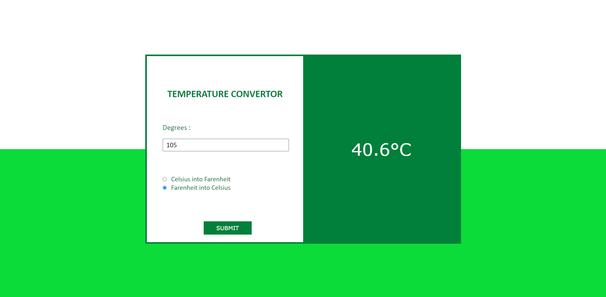

# 🌡️ Temperature Converter

A responsive temperature converter that converts between Celsius and Fahrenheit. Built with HTML, CSS, and JavaScript with real-time conversion and a clean UI.

[Deployed App](https://hanzlafullstack-temp-convertor.vercel.app/) • [GitHub Repo](https://github.com/hanzlafullstack/Temperature-convertor)



## Overview

I built this to practice form handling, mathematical calculations, and DOM manipulation. The focus is on clear user input, accurate conversion formulas, and a simple, intuitive interface for temperature conversions.

## Tech Stack

- HTML5 for structure and form elements
- CSS3 for layout and responsive design
- JavaScript (ES6+) for conversion logic and DOM updates

## Features

- Convert Celsius to Fahrenheit
- Convert Fahrenheit to Celsius
- Real-time conversion on form submission
- Input validation for numeric values
- Clean, responsive UI optimized for mobile and desktop
- Simple radio button selection for conversion direction

## Folder Structure

```
Temperature-convertor/
│
├── index.html
├── style.css
├── index.js
└── preview/
    └── image.png
```

## What Went Well

- Clear conversion formulas implemented correctly
- Simple form interface with radio button selection
- Accurate temperature conversion calculations
- Responsive design works well on different screen sizes

## What I'd Improve Next

- Add Kelvin conversion support for more flexibility
- Show conversion result in real-time as user types (without submit button)
- Add reverse conversion button to quickly swap between Celsius and Fahrenheit
- Display conversion formula or explanation for educational purposes
- Add input validation to prevent invalid characters
- Include temperature comparison examples (e.g., "32°F = 0°C - Freezing point")

## What I Learned

- Working with form inputs and radio buttons
- Mathematical formula implementation in JavaScript
- DOM manipulation to update result display
- Form validation and user input handling
- Temperature conversion formulas (C to F and F to C)

## Setup

1. Clone the repository:
   ```bash
   git clone https://github.com/hanzlafullstack/Temperature-convertor.git
   cd Temperature-convertor
   ```
2. Run locally:
   - Open `index.html` directly in your browser, or start a simple server:
     ```bash
     npx serve .
     # or
     python -m http.server 5173
     ```
3. Use the converter:
   - Enter the temperature value in the input field
   - Select conversion direction (Celsius to Fahrenheit or Fahrenheit to Celsius)
   - Click Submit to see the converted result

## Notes

- Conversion formulas:
  - Celsius to Fahrenheit: `F = (C × 9/5) + 32`
  - Fahrenheit to Celsius: `C = (F - 32) × 5/9`
- Designed as a learning project to understand form handling and calculations

## License

For learning and portfolio use. Feel free to use this as a starting point for your own converter projects.

References:  
- Deployed app: <a href="https://hanzlafullstack-temp-convertor.vercel.app/">https://hanzlafullstack-temp-convertor.vercel.app/</a>  
- Repository: <a href="https://github.com/hanzlafullstack/Temperature-convertor">https://github.com/hanzlafullstack/Temperature-convertor</a>

